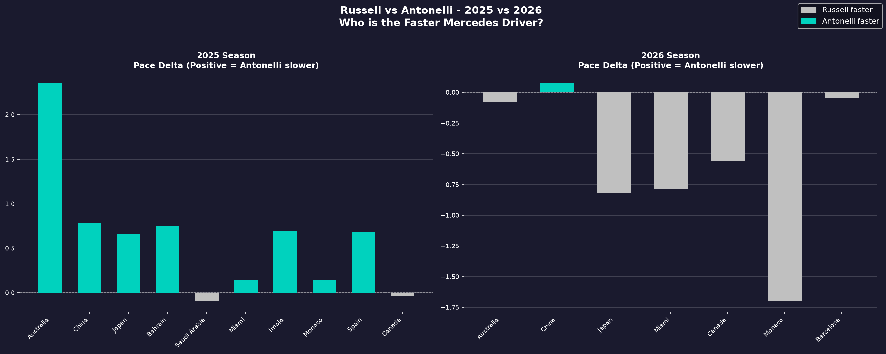
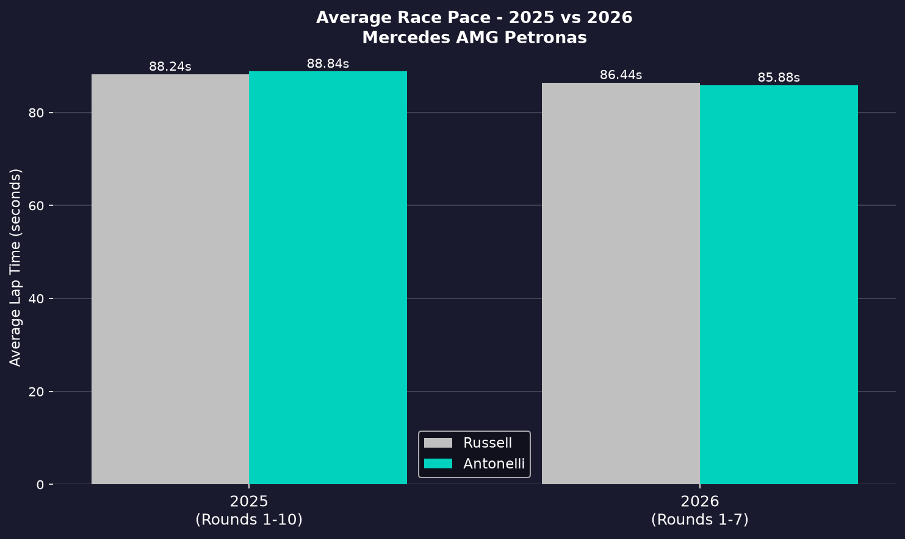
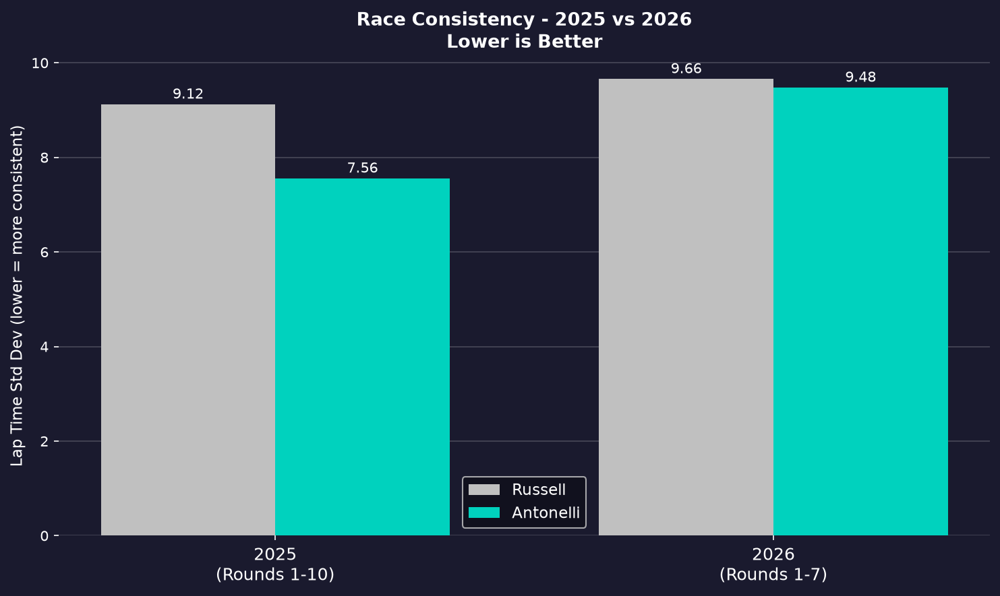
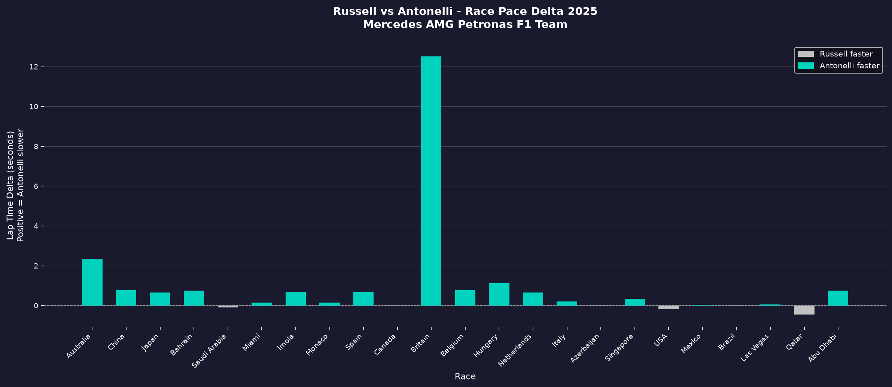
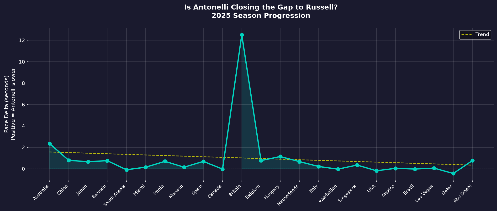

# Mercedes AMG Petronas - 2025 vs 2026 Season Analysis
### Russell vs Antonelli: Who is the Faster Mercedes Driver?

A data-driven analysis of Mercedes AMG Petronas F1 Team across two seasons using real official F1 timing data. Built with Python and the FastF1 API.

---

## The Key Finding

In 2025, George Russell was the faster Mercedes driver in 8 out of 10 races with an average pace advantage of 0.608 seconds.

In 2026, under brand new regulations, Kimi Antonelli became the faster Mercedes driver - leading in 6 out of 7 races with an average advantage of 0.560 seconds.

The roles completely flipped. A 19-year-old in his second F1 season is now outpacing a five-year Mercedes veteran on pure race pace.

---

## What This Project Covers

### Part 1 - Full 2025 Season Analysis (All 24 Races)
- Race pace comparison across every round of the 2025 season
- Tyre degradation patterns by compound
- Antonelli progression race by race through his rookie season
- Key stats: races won on pace, average gap, best and worst performances

### Part 2 - 2025 vs 2026 Comparison (Same Point in Season)
- Head to head pace delta per race across both seasons
- Average lap time improvement from 2025 to 2026 regulations
- Consistency analysis (lap time standard deviation)
- Who adapted better to the 2026 regulation changes

---

## Key Stats

### 2025 Season (Rounds 1-10)
| Driver | Avg Lap Time | Fastest Lap | Consistency (Std Dev) |
|--------|-------------|-------------|----------------------|
| Russell | 88.24s | 85.55s | 9.12 |
| Antonelli | 88.84s | 85.86s | 7.56 |

Russell faster in 8 of 10 races. Average gap: 0.608s in Russell's favor.

### 2026 Season (Rounds 1-7)
| Driver | Avg Lap Time | Fastest Lap | Consistency (Std Dev) |
|--------|-------------|-------------|----------------------|
| Russell | 86.44s | 84.99s | 9.66 |
| Antonelli | 85.88s | 84.36s | 9.48 |

Antonelli faster in 6 of 7 races. Average gap: 0.560s in Antonelli's favor.

### Pace Improvement 2025 to 2026
- Russell improved by 1.80s per lap on average
- Antonelli improved by 2.96s per lap on average
- Antonelli adapted significantly better to the new regulations

---

## Visualizations

### 2025 vs 2026 - Who is Faster Each Race?


Left panel shows 2025 - almost entirely teal (Antonelli slower). Right panel shows 2026 - almost entirely grey (Russell slower). The flip is visually undeniable.

### Average Race Pace - Both Seasons


Both drivers got faster in 2026 due to new regulations, but Antonelli improved nearly 3 seconds per lap vs Russell's 1.8 seconds.

### Race Consistency


In 2025 Antonelli was significantly more consistent than Russell (7.56 vs 9.12 std dev). In 2026 they are almost equal (9.48 vs 9.66).

### Full 2025 Season Pace Delta


### Antonelli Progression Through 2025


---

## Strategic Insights for Mercedes

Based on this data, three actionable observations for the remainder of 2026:

**1. Build strategy around Antonelli's pace advantage**
In 2026 Antonelli is consistently the faster race driver. Mercedes should consider prioritizing his strategy in races where both cars are competing for the same position rather than defaulting to team hierarchy based on 2025 performance.

**2. Russell needs to find pace in the new car**
Russell's adaptation to the 2026 regulations has been slower than Antonelli's. His consistency also dropped slightly. The team should investigate whether setup direction is working against his driving style in the new regulations.

**3. Regulation change benefited younger drivers**
The 2026 regulation reset gave Antonelli a clean slate. Without the muscle memory of the old car, he adapted faster to the new regulations. This is a pattern worth watching for the rest of the season.

---

## Tech Stack

- **Python 3.14**
- **FastF1** - Official F1 timing and telemetry API
- **Pandas / NumPy** - Data processing and aggregation
- **Matplotlib** - All visualizations

---

## Data Sources

- Official F1 timing data via FastF1 API
- 2025 Season: All 24 races (Rounds 1-24)
- 2026 Season: Rounds 1-7 (Australia to Barcelona)
- Drivers analyzed: George Russell (63) and Kimi Antonelli (12)

---

## How to Run

**1. Clone the repo**
```bash
git clone https://github.com/sparsh1909/mercedes-2025-season-analysis.git
cd mercedes-2025-season-analysis
```

**2. Install dependencies**
```bash
pip install fastf1 pandas numpy matplotlib
```

**3. Fetch full 2025 season data**
```bash
python3 mercedes_analysis.py
```

**4. Generate 2025 season visualizations**
```bash
python3 visualizations.py
```

**5. Run 2025 vs 2026 comparison**
```bash
python3 season_comparison.py
python3 comparison_viz.py
```

All plots are saved to the `/plots` folder automatically.

---

## Author

**Sparsh Harwani**
[LinkedIn](https://linkedin.com/in/sparsh-harwani-313873213) | [GitHub](https://github.com/sparsh1909)

*AI and Data Science graduate passionate about applying data science to Formula 1 and automotive.*